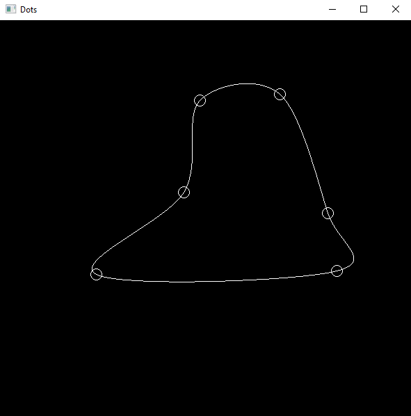

# Dots

A simple graphic application allows you to place shapes and drag-and-drop them to draw curve.

Writen using WinAPI and Gdiplus.

## Screenshots

A curve with circles.



## Architecture

When developing the application, I focused on creating an easily modifiable and supported architecture.

For example you can change circles to triangles by easely change `MainWindow::Vertix` type and `MainWindow::convert` function to work with triangles.

``` cpp
// converts POINT to Vertix
MainWindow::Vertix MainWindow::convert(POINT point)
{
    core::Dot top{ point.x, point.y - 10 };
    core::Dot left{ point.x + 8, point.y + 4 };
    core::Dot right{ point.x - 8, point.y + 4 };
    core::Triangle<core::Dot> triagle{ left, top, right };
    return core::DragNDrop{ triagle };
}
```

Result.


